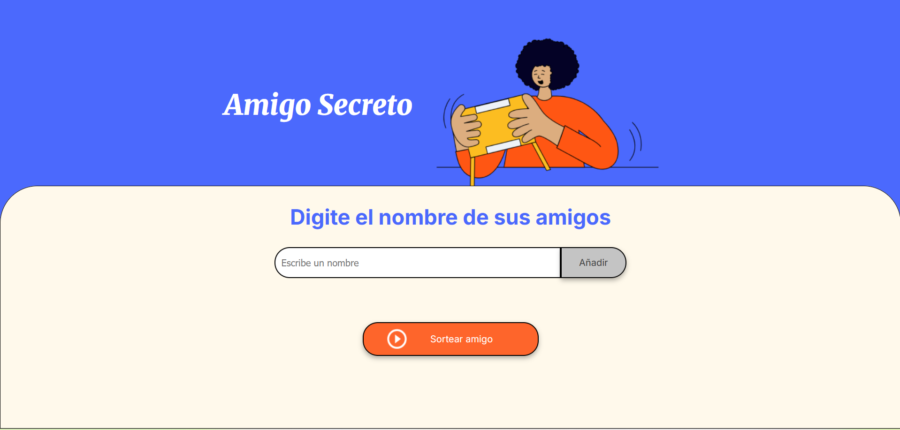

# Amigo Secreto  

¡Bienvenido al desafío *Amigo Secreto*!  

Este proyecto es una aplicación web que permite al usuario ingresar una lista de nombres y realizar un sorteo aleatorio para determinar quién es el "amigo secreto". Ideal para organizar intercambios de regalos o simplemente divertirse con amigos.  

## Funcionalidades  

- ✅ **Agregar nombres de amigos:** Ingresa el nombre de un amigo con un clic.  
- ✅ **Validación de entrada:** Si el campo está vacío, se mostrará una alerta indicando que se ingrese un nombre.  
- ✅ **Visualización de la lista de amigos:** Los nombres agregados se mostrarán en pantalla.  
- ✅ **Sorteo aleatorio de la lista de amigos:** Un botón seleccionará al azar un nombre de la lista de amigos insertaday lo mostrará resaltado como ganador.  

## Tecnologías utilizadas  

- HTML  
- CSS  
- JavaScript  

## Cómo usarlo  

1. Escribe un nombre en el campo de texto.  
2. Haz clic en el botón **"Añadir"** para agregarlo a la lista.  
3. Cuando todos los nombres estén ingresados, presiona **"Sortear Amigo"**.  
4. ¡El sistema elegirá un nombre al azar y lo mostrará en pantalla!  

